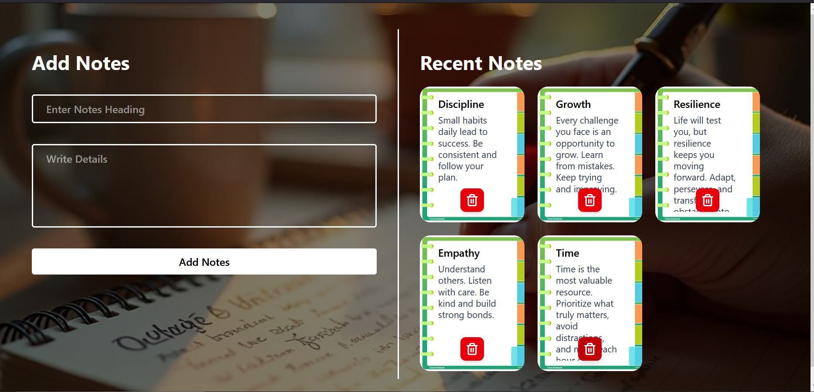
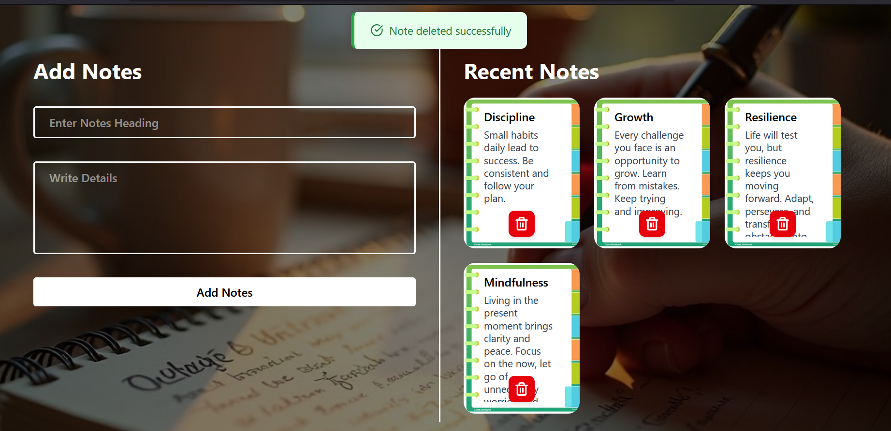
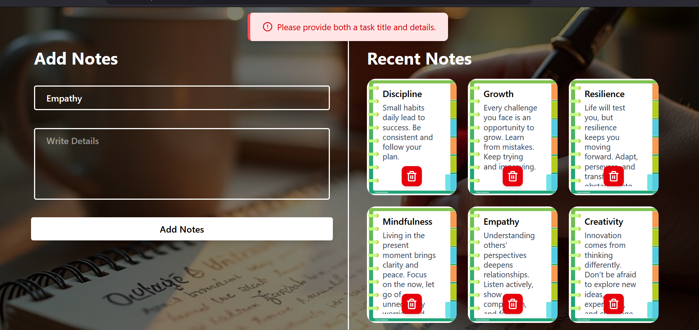
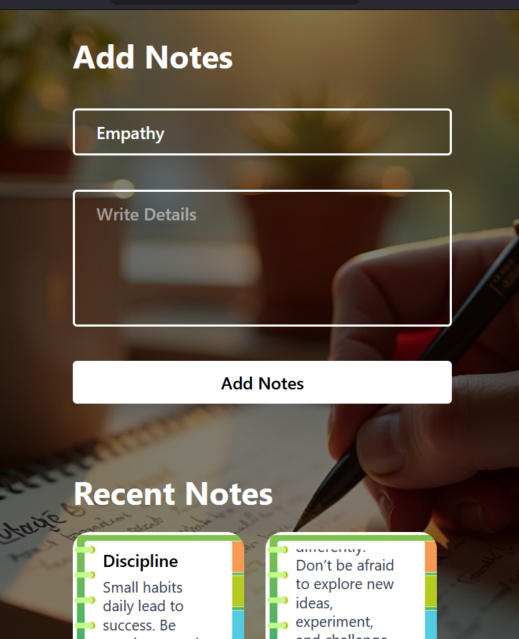

<<<<<<< HEAD
# Notes Web App (React + Tailwind + CSS)

Welcome to **Notes Web App** a sleek, interactive, and modern note-taking application built with **React**, and **Tailwind CSS**.  
It allows users to quickly **create, view, and delete notes** through a clean and responsive interface. with real-time feedback.

---

## Features

- **Add Notes Easily:** Add notes with a **title** and **detailed content** in a visually appealing card format.
- **Delete Notes Quickly:** Remove any note with a single click using a **trash icon**.
- **Real-time Feedback:** Users get **error notifications** for empty fields and **success messages** on deletion.
- **Responsive Design:** Fully responsive layout built with **Tailwind CSS**; works on **desktop and mobile**.
- **Interactive UI:** Smooth card animations, background images, and hover effects for a professional feel.
- **Icons Integration:** **Lucide React Icons** for alert, success, and delete actions for a modern, interactive experience.

---

## Tech Stack

- **React.js** : Frontend library for building interactive UIs
- **Tailwind CSS** : Utility-first CSS framework for responsive and modern styling
- **CSS** : Used for custom styling and alert messages
- **Lucide React** : Clean, open-source SVG icons
- **Vite** : Lightning-fast development environment and build tool

---

## Screenshots

<div align="center">





</div>

> Interactive, visually rich notes interface with error & success notifications.

---

## Getting Started

Follow these steps to run the project locally:

### Clone the repository

```bash
git clone https://github.com/d-anyaal/NotesWebApp-React.git
cd NotesWebApp-React
```

### Install Dependencies

```bash
npm install
```

### Start Development Server

```bash
npm run dev
```

Open your browser and go to:

```
http://localhost:5173
```
=======
# NotesWebApp-React
A simple and responsive notes app built with React and Tailwind CSS.
>>>>>>> 87de5f927bde2889d6715c762cd66880f9c74a3b
